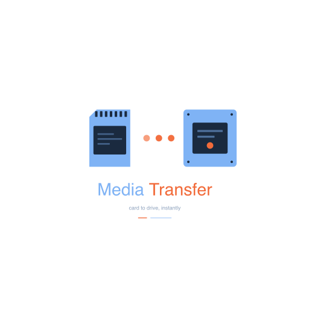

# Media Transfer

A macOS desktop app for videographers to safely offload SD / microSD cards
to an external SSD. Built with Electron + React + TypeScript.

Designed for Sony mirrorless bodies (A6700, ZV-E10, etc.) that write to the
`DCIM` and `PRIVATE/M4ROOT/{CLIP,THMBNL}` layout, but flexible enough for
any card via per-drive profiles.



---

## What it does

- Detects connected drives under `/Volumes` and recognizes them by name
- Lets you label each drive as an **Origin** (copy FROM) or **Destination**
  (copy TO)
- For origins, you pick exactly which folders to copy — with a tree picker
- Optionally **flattens** subfolders (e.g. strip Sony's `100MSDCF` so
  photos land directly under `DCIM/`)
- Copies files the first time, then **skips duplicates on re-runs** by
  matching name + size + modification time
- Shows **live progress**: percent, bytes copied, MB/s, elapsed time, ETA,
  and the current file
- **Verifies** the transfer at the end by comparing source vs destination
  byte totals per folder
- **Never deletes** from the destination — safe to re-run as often as you want

---

## Install

### Option A — Download the prebuilt DMG

1. Grab the latest DMG from the [Releases](../../releases) page (or the
   `release/` folder of this repo if you built it yourself).
2. Open the DMG and drag **Media Transfer.app** into `Applications`.
3. First launch: right-click the app → **Open** → **Open**. (The build is
   unsigned; macOS needs you to approve it once.)
4. The first time you transfer, macOS will prompt for **Removable Volume**
   access — approve it in **System Settings → Privacy & Security → Files
   and Folders**.

### Option B — Build it yourself

Requires Node.js 20+.

```bash
git clone https://github.com/eddyvarelae/media-transfer.git
cd media-transfer
npm install
npm run package       # produces release/Media Transfer-*-arm64.dmg
```

Or run it directly without packaging:

```bash
npm start             # builds + launches the app
```

---

## How to use it

### 1. Plug in your drives

Connect both your destination SSD (e.g. my `tars`) and one of your SD
cards. They'll appear under `/Volumes`.

### 2. Label new drives

If the app doesn't recognize a drive, it'll show up under **"New drive
detected"**. Click **Label this drive** to set:

- **Label** — a friendly name
- **Role** — Origin (copy FROM) or Destination (copy TO)
- **Folders** (origins only) — tick the folders you want to copy,
  navigating the tree as deep as you need
- **Flatten subfolders** (optional, per folder) — copies every file
  directly into the destination folder, ignoring subdirectories. Ideal for
  Sony's `DCIM/100MSDCF/` layout when you just want all the photos in one
  place.

Seeded profiles on first run:

| Volume      | Role        | Folders                                        | Flatten  |
| ----------- | ----------- | ---------------------------------------------- | -------- |
| `SonyA6700` | Origin      | DCIM, PRIVATE/M4ROOT/CLIP, PRIVATE/M4ROOT/THMBNL | DCIM only |
| `SonyZVE10` | Origin      | DCIM, PRIVATE/M4ROOT/CLIP, PRIVATE/M4ROOT/THMBNL | DCIM only |
| `tars`      | Destination | —                                              | —        |

You can edit or delete any profile later.

### 3. Pick origin + destination

If multiple origins or destinations are mounted, pick them from the
dropdowns at the top.

### 4. Scan

Click **Scan origin**. The app walks the selected folders, compares them
against the destination, and shows a plan: how many files to copy, how
many to skip, total size per folder.

### 5. Start the transfer

Click **Start transfer**. Watch the live progress — MB/s, elapsed, ETA,
current file. You can **Cancel** at any time.

### 6. Verify

When the transfer finishes, a verification table shows source vs
destination byte totals per folder. Destination ≥ source means you're safe
to reformat the card. (The destination can be larger than the source after
multiple transfers — that's expected.)

### 7. Scan again

Click **Scan origin again** to re-plan after adding more clips, or to
verify that a previous run really covered everything.

---

## Folder layout on the destination

For a card called `SonyA6700` and a destination called `tars`, files land at:

```
/Volumes/tars/SonyA6700/
  ├── DCIM/              ← flat if "flatten" is on, otherwise mirrors card
  │   ├── DSC00001.JPG
  │   └── DSC00002.JPG
  ├── CLIP/
  │   ├── C0001.MP4
  │   └── C0001M01.XML
  └── THMBNL/
      └── C0001T01.JPG
```

Re-runs add new files only. Nothing is ever removed from the destination.

---

## Configuration

Profiles live at:

```
~/Library/Application Support/Media Transfer/profiles.json
```

You normally don't need to edit this by hand — use the UI. But you can
back it up, share it, or reset it by deleting the file (the app re-seeds
defaults on next launch).

---

## Scripts

| Script                  | What it does                             |
| ----------------------- | ---------------------------------------- |
| `npm install`           | Install dependencies                     |
| `npm start`             | Build + launch the app                   |
| `npm run build:renderer`| Build the React/Vite renderer            |
| `npm run build:main`    | Build the Electron main + preload bundles |
| `npm run package`       | Full DMG build → `release/`              |

---

## Tech stack

- Electron 29 (main) + Node 20
- React 18 + TypeScript (renderer)
- Vite for the renderer build
- esbuild for the main/preload bundles
- electron-builder for DMG packaging

---

## Caveats

- **Unsigned build.** The DMG isn't code-signed, so macOS asks for approval
  on first launch. Right-click → Open → Open.
- **Flatten collisions.** If two files under the same folder tree share a
  basename but have different content, flatten will overwrite. On Sony
  cards the counter increments across subfolders, so this is effectively
  never an issue — but worth knowing.
- **Apple Silicon build.** The packaged DMG targets arm64. Intel Macs need
  to rebuild with `electron-builder --mac --x64`.
- **No deletion safety net needed** because the app never deletes from
  the destination — it only adds files.

---

## Build history

See [CONVERSATION.md](CONVERSATION.md) for the full build log, including
every prompt and decision from the one-session build with Claude Code.

---

## License

MIT.
